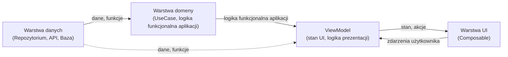
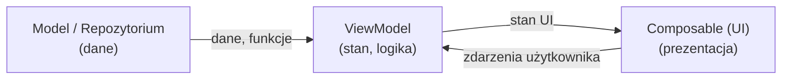

# Architektura aplikacji

## Dlaczego zadbanie o architekturę aplikacji jest istotne?

Dobrze zaprojektowana architektura aplikacji to klucz do sukcesu każdego większego projektu. W kontekście Jetpack Compose i nowoczesnych aplikacji Android warto zadbać o architekturę, ponieważ:

- **Łatwiejsze utrzymanie kodu**  
  Jasny podział odpowiedzialności sprawia, że kod jest czytelny i łatwy do zrozumienia nawet po dłuższym czasie lub przez nowych członków zespołu.

- **Skalowalność**  
  Aplikacja z przemyślaną architekturą łatwiej się rozbudowuje o nowe funkcje bez ryzyka wprowadzania błędów w istniejących częściach.

- **Testowalność**  
  Oddzielenie tzw. logiki funkcjonalnej aplikacji od UI umożliwia łatwe pisanie testów jednostkowych i integracyjnych, co zwiększa niezawodność aplikacji.

- **Unikanie duplikacji i błędów**  
  Centralizacja logiki (np. w ViewModelu lub repozytorium) pozwala uniknąć powielania kodu i przypadkowych rozbieżności w zachowaniu aplikacji.

- **Lepsza współpraca w zespole**  
  Jasny podział na warstwy (UI, ViewModel, repozytorium) pozwala pracować równolegle kilku osobom bez konfliktów.

- **Łatwiejsza migracja i refaktoryzacja**  
  Gdy pojawią się nowe technologie lub potrzeba zmiany źródła danych, dobrze zaprojektowana architektura pozwala na łatwą wymianę poszczególnych warstw bez przepisywania całej aplikacji.

Dobra architektura to inwestycja, która procentuje przez cały cykl życia aplikacji – od prototypu, przez rozwój, aż po utrzymanie i rozwój nowych funkcji.

---

## Podstawowe zasady przy projektowaniu architektury aplikacji

Projektując nowoczesną architekturę aplikacji (szczególnie w Compose), warto kierować się poniższymi zasadami:

- **Single Source of Truth (SSOT)**  
  Każdy fragment stanu aplikacji powinien mieć jedno, centralne źródło prawdy (np. ViewModel lub repozytorium). Dzięki temu unikasz niespójności i trudnych do znalezienia błędów.

- **Unidirectional Data Flow (UDF)**  
  Dane płyną w jedną stronę: od źródła (Model/Repozytorium) przez ViewModel do UI. Zdarzenia użytkownika wracają do ViewModelu, który aktualizuje stan. To upraszcza debugowanie i testowanie.

- **Separation of Concerns (SoC)**  
  Każda warstwa aplikacji ma jasno określoną odpowiedzialność: UI wyświetla dane, ViewModel zarządza logiką i stanem, repozytorium dostarcza dane.

- **Immutability (Niezmienność stanu)**  
  Stan przekazywany do composable powinien być niezmienny (np. `val`). Zmiany stanu powinny być realizowane przez ViewModel, a nie bezpośrednio w UI.

- **Testowalność**  
  Logika funkcjonalna aplikacji powinna być łatwa do przetestowania – unikaj jej w composable, trzymaj ją w ViewModelu lub repozytorium.


Stosowanie tych zasad pozwala budować aplikacje, które są czytelne, łatwe w utrzymaniu i odporne na błędy.

--- 

## Rekomendowana architektura aplikacji w Jetpack Compose

Tworząc aplikacje z użyciem Jetpack Compose, warto stosować nowoczesne podejście do architektury, które zapewnia czytelność, łatwość testowania i rozdzielenie odpowiedzialności. 

### Podział na warstwy

W praktyce architektura aplikacji dzieli się na kilka warstw:



- **Warstwa UI (prezentacji)**  
  Zawiera composable, które odpowiadają za wyświetlanie danych i obsługę interakcji użytkownika. UI nie powinno zawierać logiki funkcjonalnej aplikacji ani bezpośredniego dostępu do danych.  
  **ViewModel znajduje się w warstwie UI jako tzw. state holder** – zarządza stanem ekranu i udostępnia go composable, ale nie powinien zawierać logiki dostępu do danych ani logiki funkcjonalnej aplikacji (te powinny być w repozytoriach i warstwie domeny).

- **Warstwa danych (Data Layer)**  
  Odpowiada za dostęp do danych – zarówno lokalnych (baza danych, pliki), jak i zdalnych (API, sieć). Najczęściej realizowana przez repozytoria.

- **(Opcjonalnie) Warstwa domeny (Domain Layer)**  
  W większych projektach można wydzielić dodatkową warstwę domeny, która zawiera logikę funkcjonalną aplikacji niezależną od źródeł danych i UI. Pozwala to na jeszcze lepsze rozdzielenie odpowiedzialności i łatwiejsze testowanie.


## Główne elementy architektury Compose


### 1. **View (UI) – Composable**
- Odpowiada za wyświetlanie danych i obsługę interakcji użytkownika.
- Nie zawiera logiki funkcjonalnej aplikacji ani dostępu do danych.
- Otrzymuje dane jako parametry (np. stan UI) i wywołuje akcje przekazane z ViewModelu.

### 2. **ViewModel**
- Przechowuje i zarządza stanem UI.
- Udostępnia dane do composable przez `State` lub `StateFlow`.
- Obsługuje logikę funkcjonalną aplikacji, reaguje na akcje użytkownika.
- Komunikuje się z repozytoriami i warstwą danych.
- Obsługuje zmiany konfiguracji (np. obrót ekranu).

> **Informacja**: Więcej o ViewModel w kolejnej sekcji


### 3. **Repository (Repozytorium)**
- Abstrakcja nad źródłami danych (np. sieć, baza danych, pliki).
- Umożliwia łatwą zamianę implementacji (np. do testów).
- ViewModel korzysta z repozytorium, nie z bezpośrednich źródeł danych.

### 4. **Model**
- Klasy danych (np. `data class`), które reprezentują dane aplikacji.


---

## Przepływ danych (Unidirectional Data Flow, UDF)

**Unidirectional Data Flow (UDF)** to jedna z kluczowych zasad nowoczesnej architektury aplikacji, szczególnie w Jetpack Compose. Oznacza ona, że dane w aplikacji przepływają zawsze w jednym kierunku, co upraszcza zarządzanie stanem i debugowanie.



- Dane płyną od Modelu/Repozytorium do ViewModelu, następnie do UI.
- Zdarzenia użytkownika wracają z UI do ViewModelu, który aktualizuje stan.
  
### Jak działa UDF w Compose?

1. **Źródło danych (Model/Repozytorium)**  
   Przechowuje i dostarcza dane (np. z sieci, bazy danych).

2. **ViewModel**  
   Pobiera dane z repozytorium, przetwarza je i udostępnia stan UI jako `State`, `StateFlow`.

   ViewModel reaguje na zdarzenia użytkownika, aktualizuje stan i przekazuje go do UI.

3. **Composable (UI)**  
   Otrzymuje stan jako parametr i wyświetla go.  
   Nie modyfikuje stanu bezpośrednio – zamiast tego wywołuje funkcje/akcje przekazane z ViewModelu (np. przez lambdy).

4. **Zdarzenia użytkownika**  
   Akcje użytkownika (np. kliknięcia, wpisywanie tekstu) są przekazywane do ViewModelu, który aktualizuje stan.  
   Zaktualizowany stan ponownie trafia do UI.


### Zalety UDF

- **Przewidywalność** – zawsze wiadomo, skąd pochodzą dane i gdzie są modyfikowane.
- **Łatwiejsze debugowanie** – zmiany stanu są kontrolowane i łatwe do prześledzenia.
- **Lepsza testowalność** – logika funkcjonalna aplikacji jest oddzielona od UI.
- **Mniej błędów związanych z nieoczekiwanymi zmianami stanu**.


---

## ViewModel i przechowywanie stanu (StateFlow, MutableStateFlow)

**ViewModel** to komponent architektury Androida, który odpowiada za przechowywanie i zarządzanie stanem UI oraz logiką prezentacji. Jego główną zaletą jest to, że przeżywa zmiany konfiguracji (np. obrót ekranu), dzięki czemu nie tracisz stanu ekranu.

### Przechowywanie stanu w ViewModelu

W nowoczesnych aplikacjach Compose rekomenduje się przechowywanie stanu za pomocą **StateFlow** i **MutableStateFlow** z biblioteki Kotlin Coroutines.

- **MutableStateFlow** – służy do wewnętrznego zarządzania stanem w ViewModelu (możesz zmieniać jego wartość).
- **StateFlow** – jest tylko do odczytu i udostępniasz go do UI (Composable).
- **Jednoczesne wykorzystanie MutableStateFlow (do modyfikacji) oraz StateFlow (do odczytu) to tzw. enkapsulacja stanu** – tylko ViewModel może zmieniać stan, a UI ma dostęp wyłącznie do wersji tylko do odczytu. Dzięki temu unikasz przypadkowych modyfikacji stanu z poziomu UI i zachowujesz pełną kontrolę nad przepływem danych.
  
#### Prosty przykład

```kotlin
class MyViewModel : ViewModel() {
    // Wewnętrzny, modyfikowalny stan
    private val _uiState = MutableStateFlow("Początkowy stan")
    // Publiczny, tylko do odczytu
    val uiState: StateFlow<String> = _uiState

    fun updateState(newValue: String) {
        _uiState.value = newValue
    }
}
```


```kotlin
@Composable
fun MyScreen(viewModel: MyViewModel = viewModel()) {
    val uiState by viewModel.uiState.collectAsState()

    Column {
        Text(text = uiState)
        Button(onClick = { viewModel.updateState("Nowy stan") }) {
            Text("Zmień stan")
        }
    }
}
```
#### Przechowywanie stanu w ViewModelu z wykorzystaniem sealed interface/class

W bardziej rozbudowanych ekranach zaleca się przechowywanie stanu ekranu jako obiektu klasy sealed (sealed interface lub sealed class). Pozwala to jasno opisać różne możliwe stany UI (np. ładowanie, sukces, błąd) i ułatwia zarządzanie nimi w composable.

**Przykład:**

```kotlin
// Definicja stanu ekranu
sealed interface UiState {
    object Loading : UiState
    data class Success(val data: String) : UiState
    data class Error(val message: String) : UiState
}

// ViewModel z enkapsulacją stanu
class MyViewModel : ViewModel() {
    private val _uiState = MutableStateFlow<UiState>(UiState.Loading)
    val uiState: StateFlow<UiState> = _uiState

    fun loadData() {
        viewModelScope.launch {
            try {
                _uiState.value = UiState.Loading
                val result = fetchDataFromNetwork() // np. suspend fun
                _uiState.value = UiState.Success(result)
            } catch (e: Exception) {
                _uiState.value = UiState.Error("Wystąpił błąd")
            }
        }
    }
}
```

**W Composable:**

```kotlin
@Composable
fun MyScreen(viewModel: MyViewModel = viewModel()) {
    val uiState by viewModel.uiState.collectAsState()

    when (uiState) {
        is UiState.Loading -> CircularProgressIndicator()
        is UiState.Success -> Text((uiState as UiState.Success).data)
        is UiState.Error -> Text((uiState as UiState.Error).message, color = Color.Red)
    }
}
```

Takie podejście pozwala w prosty sposób obsłużyć różne scenariusze w UI i zachować pełną kontrolę nad przepływem stanu.

---
## Zalecenia i dobre praktyki

- **Stan UI trzymaj w ViewModelu**  
  Przechowuj cały stan ekranu w ViewModelu, korzystając z `StateFlow`, `MutableStateFlow` lub `mutableStateOf`. Dzięki temu stan jest odporny na zmiany konfiguracji i łatwy do testowania.

- **Composable powinny być jak najbardziej proste**  
  Composable powinny tylko wyświetlać dane i przekazywać akcje do ViewModelu. Unikaj logiki funkcjonalnej aplikacji i zarządzania stanem w composable.


- **Unikaj logiki funkcjonalnej aplikacji w composable**  
  Cała logika funkcjonalna aplikacji powinna być w ViewModelu lub (w większych projektach) w warstwie domeny (use case). UI powinno być tylko warstwą prezentacji.

- **Stosuj enkapsulację stanu**  
  Udostępniaj do UI tylko wersję stanu do odczytu (`StateFlow`, `State`), a modyfikacje wykonuj wyłącznie w ViewModelu. To chroni przed przypadkowymi zmianami stanu z poziomu UI.


- **Stosuj Unidirectional Data Flow (UDF)**  
  Przepływ danych powinien być jednokierunkowy: dane płyną z ViewModelu do UI, a zdarzenia użytkownika wracają do ViewModelu.


## Więcej informacji

- [Oficjalna dokumentacja architektury Compose](https://developer.android.com/jetpack/compose/architecture)
- [Nowoczesna architektura Androida – przewodnik](https://developer.android.com/topic/architecture)
- [Przykładowy projekt Compose: Now in Android](https://github.com/android/nowinandroid)

---
### 🧭 **Następny temat:** [Praca w tle: Korutyny](https://github.com/MarcinRod/AndroidLecture2025/blob/main/10%20Zadania%20w%20tle%20-%20Korutyny.md)