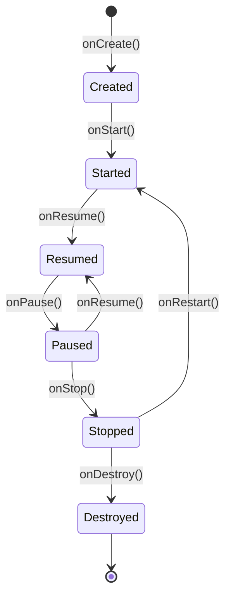

# 📱 Aktywność (Activity) i jej cykl życia

---

## 🔹 Co to jest `Activity`?

**`Activity`** to jeden z podstawowych komponentów aplikacji Android. Reprezentuje **pojedynczy ekran interfejsu użytkownika** – czyli wszystko, co widzi i z czym wchodzi w interakcję użytkownik w danym momencie. Przykładowo, ekran logowania, lista kontaktów czy szczegóły produktu to osobne aktywności.

Każda aplikacja musi mieć co najmniej jedną aktywność, najczęściej jest to ekran główny (`MainActivity`). Aktywność zarządza cyklem życia ekranu, reaguje na działania użytkownika, obsługuje zdarzenia systemowe (np. obrót ekranu, powrót do aplikacji) oraz odpowiada za wyświetlanie i aktualizowanie interfejsu.

W tradycyjnym Androidzie aktywność definiuje się jako klasę dziedziczącą po `Activity` lub `AppCompatActivity`. W nowoczesnym podejściu z Jetpack Compose aktywność często ogranicza się do **osadzenia composable** w `setContent`, np.:

```kotlin
class MainActivity : ComponentActivity() {
    override fun onCreate(savedInstanceState: Bundle?) {
        super.onCreate(savedInstanceState)
        setContent {
            MyApp()
        }
    }
}
```

---

## 🔄 Cykl życia aktywności

Aktywności w Androidzie podlegają cyklowi życia, który jest zarządzany przez system operacyjny. Cykl życia składa się z **serii metod wywoływanych automatycznie** przez system w zależności od interakcji użytkownika, stanu urządzenia czy zasobów.

---

## 🧭 Schemat cyklu życia 



---

## 🧩 Opis metod cyklu życia

| Metoda         | Opis |
|----------------|------|
| `onCreate()`   | Wywoływana przy pierwszym tworzeniu aktywności. Tutaj inicjalizujemy interfejs użytkownika, ustawiamy widoki, odczytujemy dane z `savedInstanceState`, rejestrujemy listenerów, inicjalizujemy ViewModel, otwieramy połączenia z bazą danych itp. |
| `onStart()`    | Aktywność staje się widoczna dla użytkownika, ale jeszcze nie jest na pierwszym planie. Można tu np. rozpocząć animacje lub przygotować zasoby, które są potrzebne, gdy aktywność jest widoczna. |
| `onResume()`   | Aktywność uzyskuje fokus i staje się aktywna (gotowa na interakcję). Tutaj wznawiamy wstrzymane operacje, np. odtwarzanie wideo, uruchamiamy czujniki, wznawiamy animacje. |
| `onPause()`    | Aktywność traci fokus, np. po otwarciu innej aktywności lub dialogu. Tu należy zapisać tymczasowe dane, zatrzymać animacje, wstrzymać odtwarzanie multimediów, wyrejestrować odbiorniki, zatrzymać czujniki. |
| `onStop()`     | Aktywność nie jest już widoczna. Tutaj zwalniamy zasoby, zapisujemy dane do trwałego magazynu, zamykamy połączenia z bazą danych, zatrzymujemy ciężkie operacje. |
| `onRestart()`  | Wywoływana, gdy aktywność wraca na pierwszy plan po zatrzymaniu (`onStop`). Można tu ponownie zainicjalizować zasoby zwolnione w `onStop()`. |
| `onDestroy()`  | Aktywność jest niszczona – np. po zamknięciu lub przy zmianie konfiguracji. Tu należy zwolnić wszystkie zasoby, wyrejestrować listenerów, zamknąć połączenia, zatrzymać wątki. |

---

### Przykłady użycia metod cyklu życia

- **onCreate()**: Inicjalizacja UI, ustawienie adapterów, pobranie danych z bazy, rejestracja listenerów.
- **onStart()**: Rozpoczęcie animacji, rejestracja BroadcastReceiver, sprawdzenie uprawnień.
- **onResume()**: Wznowienie odtwarzania muzyki, uruchomienie kamery, rozpoczęcie śledzenia lokalizacji.
- **onPause()**: Zatrzymanie odtwarzania wideo, zapisanie szkicu formularza, wyrejestrowanie czujników.
- **onStop()**: Zapisanie danych do bazy, zamknięcie połączenia z API, zatrzymanie usług.
- **onDestroy()**: Zwolnienie pamięci, zamknięcie połączeń sieciowych, wyrejestrowanie listenerów.

---

## 🧠 Dlaczego to ważne?

Zrozumienie cyklu życia aktywności pozwala na:

- **Oszczędzanie baterii i zasobów**  
  Przykład: zatrzymywanie odtwarzania wideo, muzyki lub czujników w `onPause()` i `onStop()`, aby nie zużywać niepotrzebnie energii, gdy użytkownik nie korzysta z aplikacji.
- **Unikanie błędów przy zmianie orientacji**  
  Przykład: zapisanie stanu formularza lub przewinięcia listy w `onSaveInstanceState()` i odtworzenie go w `onCreate()`, aby użytkownik nie stracił danych po obrocie ekranu.
- **Zachowanie stanu aplikacji**  
  Przykład: zapisywanie tymczasowych danych (np. tekstu w polu edycji) podczas przechodzenia do innej aplikacji, aby po powrocie użytkownik mógł kontynuować pracę.
- **Lepsza kontrola nad zewnętrznymi zasobami**  
  Przykład: zamykanie połączeń z bazą danych, zatrzymywanie usług lokalizacyjnych, wyrejestrowywanie odbiorników systemowych, aby nie powodować wycieków pamięci i niepotrzebnego zużycia zasobów.
- **Bezpieczeństwo i prywatność**  
  Przykład: ukrywanie wrażliwych danych lub wylogowywanie użytkownika po dłuższej nieaktywności.
- **Poprawa wydajności aplikacji**  
  Przykład: ładowanie dużych danych tylko wtedy, gdy aktywność jest widoczna, a nie w tle.

Dzięki prawidłowemu zarządzaniu cyklem życia aplikacja działa płynnie, jest stabilna i nie zużywa niepotrzebnie zasobów urządzenia.


---

## 🌐 Kontekst aplikacji (`Context`)

### 🔹 Co to jest `Context`?

**`Context`** to jedna z najważniejszych klas w Androidzie. Reprezentuje **bieżący stan aplikacji** i zapewnia dostęp do zasobów systemowych, plików, baz danych, preferencji, usług systemowych oraz informacji o środowisku, w którym działa aplikacja.

### 🔑 Najważniejsze zastosowania `Context`:

- **Dostęp do zasobów**: np. `getString(R.string.app_name)`, `getDrawable(R.drawable.icon)`
- **Uruchamianie nowych aktywności i usług**: np. `startActivity(intent)`, `startService(intent)`
- **Dostęp do plików i baz danych**: np. `openFileInput()`, `openOrCreateDatabase()`
- **Dostęp do preferencji**: np. `getSharedPreferences()`
- **Uzyskiwanie usług systemowych**: np. `getSystemService(Context.CONNECTIVITY_SERVICE)`


### 🧩 Typowe klasy dziedziczące po `Context`:

- **`Application`** – kontekst globalny, żyje tak długo jak aplikacja.
- **`Activity`** – kontekst powiązany z pojedynczym ekranem.
- **`Service`** – kontekst powiązany z usługą.
- **`BroadcastReceiver`** – dostępny przez krótką chwilę w metodzie `onReceive()`.

### 🧩 `Context` w Compose?

W Compose  nie mamy bezpośredniego dostępu do kontekstu (jak w Activity przez `this`), dlatego korzystamy z funkcji pomocniczych.


W funkcjach composable używamy:

```kotlin
val context = LocalContext.current
```

`LocalContext` to CompositionLocal, który udostępnia aktualny kontekst (najczęściej Activity lub Application).

### 🔑 Przykłady użycia `Context` w Compose

- **Dostęp do zasobów:**

  ```kotlin
  val context = LocalContext.current
  val appName = context.getString(R.string.app_name)
  ```


- **Start nowej aktywności:**

  ```kotlin
  val context = LocalContext.current
  Button(onClick = {
      val intent = Intent(context, DetailsActivity::class.java)
      context.startActivity(intent)
  }) {
      Text("Przejdź dalej")
  }
  ```

- **Uzyskanie usługi systemowej:**

  ```kotlin
  val context = LocalContext.current
  val connectivityManager = context.getSystemService(Context.CONNECTIVITY_SERVICE) as ConnectivityManager
  ```

### ⚠️ Ważne wskazówki

- **Nie przechowuj referencji do `Context` poza composable!**  
  Zawsze pobieraj aktualny kontekst przez `LocalContext.current` w ciele composable lub lambdzie onClick.
- **Do operacji globalnych (np. repozytoria, ViewModel)** używaj `context.applicationContext`.
- **Do operacji związanych z UI** (np. Toast, startActivity) używaj bieżącego kontekstu z `LocalContext`.

---

## 📚 Dodatkowe materiały i dokumentacja

- [Oficjalna dokumentacja Android – Activity](https://developer.android.com/guide/components/activities/intro)
- [Poradnik cyklu życia aktywności](https://developer.android.com/guide/components/activities/activity-lifecycle)
- [Oficjalna dokumentacja Android – Context](https://developer.android.com/reference/android/content/Context)
- [Jetpack Compose – dostęp do Context](https://developer.android.com/jetpack/compose/side-effects#context)

---
### 🧭 **Następny temat:** [Zasoby aplikacji](4%20Zasoby.md)
